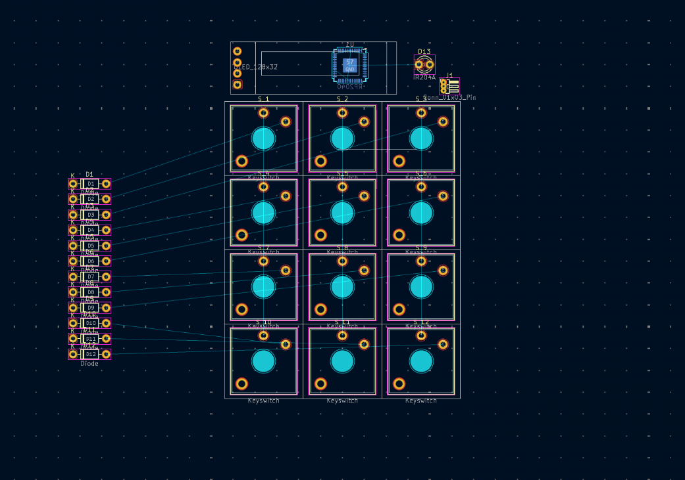

# 6/27:

reusing the old repo because i'm deciding to actually make my oroginal idea: a tv-remote using ir leds but it controls my pc

I'm redoing the schematic and pcb, also using choc switches for better comfort in hand

I got some of the components in the schematic and layed out the switches, which I changed from choc to mx.

I considered using a xiao but there was no clean way to fit it with the usb port at the bottom

Also I'm considering using an esp32 and wifi instead of an ir blaster, which would be easier to use and allow for 2 way communication as well as being used as a bluetooth keyboard

**Time: 3 Hours**
